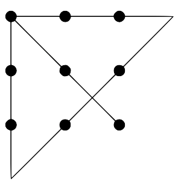

# Logic: Lesson 5

## Introduction: “Think Outside the Box” **3:30 - 3:40**

1. Start by drawing 3X3 dots, 9 dots. 
2. Ask, how do you connect all the dots with 4 straight lines without lifting your pen up?
3. Solution: 

## Real Life **3:40 - 3:55**
 Tell the kids to get into groups of __ and form a square. Give each group a long piece of string and tell each group to figure out the best way to connect everyone by using up all the string and by using up most of the interior of the square. The team with the best strategy wins candy! (everyone else gets some in the end) 

## Think more: **3:55 - 4:05**
Pass out paper for each students. Question: Is there any way. Any. how you can have 2 separated  rectangles without lifting your pen or pencil? 
Solution: Fold the paper.  
 	

## Guess and Shape **4:05 - 4:25**
1. Show them a shape by walking and let them guess. (Triangle, Rectangle, etc)
2. Ask the angle turned by the teacher. 
	a. Equilateral Triangle will require you to turn 120 degrees, not 60 degrees.  (Exterior Angle) and explain. Make sure everyone       understands.
3. Ask for volunteers to do it. (But it should be a shape)

## Conclusion: What did you learn? **4:25-4:30**
1. Thinking deeply
2. Exterior Angle
3. Use of teamwork and different shapes

